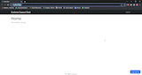

# SupportDesk Real-time Chat Interface
[](https://opensource.org/licenses)

Real-time chat interface template for businesses to troubleshoot for clients

### User Story
```
AS a business owner
I WANT to interact with clients on the browser 
SO THAT I can reduce cost expenditures by quickly resolving issues online without the use of phonecalls
```

## Table of Contents

[Deployment](#deployment)

[Installation](#installation)

[Contribution](#contribution)

[Gifs](#gifs)

[Questions](#questions)

----

<a name="deployment"></a>
### Deployment

[Support Desk](https://cliffordstevenson.github.io/supportdesk/)

<a name="installation"></a>
### Installation

For local hosting:

1. `git clone` this repository
2. `npm run dev`

<a name="contribution"></a>
### Contribution

Single contribution project 

<a name="gifs"></a>
### Gifs

##### App Demo


<a href="https://www.youtube.com/watch?v=j_0gAi-mRqQ" target="_blank">
  
</a>

----

<a name="questions"></a>
### Questions
##### Contact Me

Feel free to contact me via GitHub or email with any feedback 

[GitHub u/cliffordstevenson](https://github.com/cliffordstevenson)
clifford.andrew.stevenson@gmail.com
