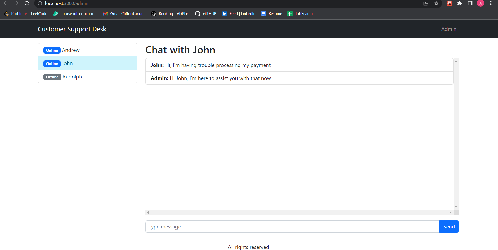

# SupportDesk Real-time Chat Interface

## This React.js project was designed with the intent of adding customer support functionality so that businesses can field questions and concerns from users. For example shipping issues, subcription payment troubleshooting, etc. 

Real-time chat interface designed with socket.io for company websites to provide customer support chat functionality. This project was my first time using and learning websockets to get real-time call and responses between different user pages. With React hooks like useState and useRef, varying user status' are displayed in real-time to the admin chat page (like online, offline, new user), in addition to the real-time chat, so that online customer support staff can message directly with service users and resolve issues in real-time.

* React.js and bootstrap used to efficiently generate a user-friendly, responsive website
* Socket.io and Node.js utilised to create a scalable back-end
* React Hooks like useState and useRef to handle form inputs
* Created using functional components and react-router-dom to render different screens for different types of users (admin, users)
* real-time messages with socket.io

## Watch the demo

## How to run this project on your local device
1. clone the git repository to VS Code
2. run in client terminal `npm run start`
3. run in server terminal `npm start`
4. navigate to localhost 4000

## Find a bug? 
feel free to contact me via email
